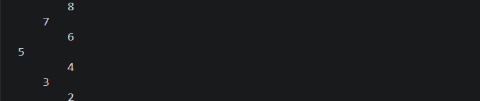
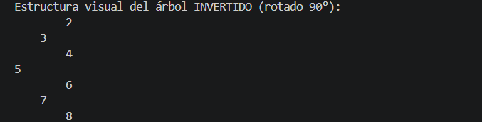
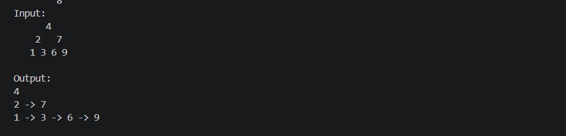
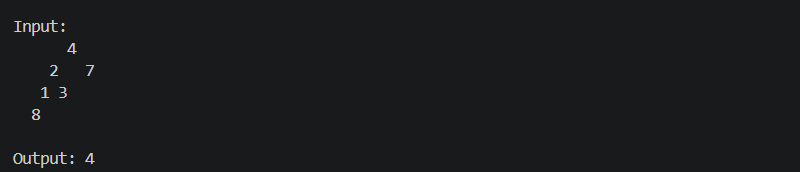

# Práctica: Estructuras de Datos No Lineales - Árboles Binarios

## Información del Estudiante
* **Nombre del Estudiante:** Ariel Ushca
* **Carrera:** Computación

---

## Descripción General del Proyecto
El diseño, desarrollo e implementación de operaciones básicas sobre estructuras de datos no lineales, particularmente **Árboles Binarios de Búsqueda (BST)**, es la esencia de este proyecto. Durante la práctica se tratan algoritmos de inserción autogestionada, inversión especular de estructuras en memoria, recorridos por niveles en anchura (BFS) a través del uso de colas dinámicas y el cálculo de la profundidad máxima de un árbol por medio de métodos recursivos de dividir y conquistar.

---

## Explicación del Ejercicio 01 y del método `insert`
* **Descripción:** Automatiza la generación de un árbol binario de búsqueda a partir de una secuencia lineal de datos numéricos.
* **Procedimiento `insert(int[] numeros)`**: Toma como parámetro un arreglo de enteros unidimensional. El método recorre cada elemento del arreglo y llama en sucesión a la lógica de adición del árbol (`tree.add(numero)`), que evalúa de forma recursiva si el valor que se introduce es menor (subárbol izquierdo) o mayor/igual (subárbol derecho) que el nodo actual, para colocar adecuadamente dicho valor dentro de la estructura jerárquica. Al concluir las inserciones, invoca los procedimientos de graficación para dibujar el árbol en la consola.

---

## Explicación del Ejercicio 02 y del método `invertTree`
* **Descripción:** Convierte un árbol binario original en una réplica idéntica a su imagen de espejo.
* **Método `invertTree(Node<Integer> actual)`**: Implementa un método recursivo de post-orden, que va desde abajo hasta arriba. Analiza el nodo actual y, en caso de que no sea nulo, guarda temporalmente la referencia de uno de sus hijos. Luego, asigna el puntero izquierdo al nodo derecho y el puntero derecho a la referencia que se ha guardado en la variable temporal. Después, extiende esta inversión recursivamente a todos los niveles inferiores de los subárboles.

---

## Explicación del Ejercicio 03 y del método `listLevels`
* **Descripción:** Clasifica y agrupa los componentes del árbol binario según el nivel de profundidad en que se encuentran.
* **Método `listLevels(Node<?> root)`**: Se basa en el algoritmo de búsqueda en amplitud (BFS) y emplea una estructura de cola (`Queue`) para su funcionamiento. Se anota el tamaño de la cola (`levelSize`) al comienzo de cada repetición del bucle principal. Este valor funciona como un límite estricto para obtener solamente los nodos de ese nivel, reunirlos de manera ordenada en una sublista lineal (`List<Node<?>>`) e introducir sus correspondientes hijos en la cola a fin de procesar el siguiente nivel jerárquico.

---

## Explicación del Ejercicio 04 y del método `maxDepth`
* **Descripción:** Establece la longitud de la ruta más extensa que va del nodo raíz a la hoja terminal más alejada.
* **Método `maxDepth(Node<?> root)`**: Opera bajo una estrategia completamente recursiva. Devolverá 0 (caso base) si el nodo evaluado es nulo. Si no es así, determina de forma autónoma la altura más alta que llegó el subárbol derecho y el subárbol izquierdo. Por último, emplea la función matemática `Math.max()` para escoger la profundidad más grande de los dos caminos, incrementándola en una unidad (`+ 1`), lo que representa la contribución del nivel del nodo presente al cálculo total.
---

## Capturas
### Ejercicio uno

### Ejercicio dos

### Ejercicio tres

### Ejercicio cuatro

